People building AI agents throw around "harness," "loop," and "graph" as if they're interchangeable. They aren't. All three sit around the same model, all three affect reliability, and all three can technically contain a "loop" somewhere — which is exactly why they get mixed up. But they answer three different questions, and the distinction stops being academic the moment an agent leaves a demo notebook and starts touching files, APIs, customers, or production code.

The short version: **harness** decides what the agent can access and how it acts. **Loop** decides how it knows when it's actually done. **Graph** decides what's allowed to run next. In a real system they nest inside each other:

A raw language model can't create files, hold project state, run a test suite, look at a browser, enforce an approval rule, or restart a failed job on its own — those capabilities come entirely from the environment around it. As agentic software has matured, a fairly standard stack has formed around that fact: a harness runs the model, loops handle the repeating execution and quality checks, and — for systems complex enough to need it — a graph maps the structured paths the process is allowed to take.

## Agent Harness Engineering

[[ai-engineering|AI engineering]] has mostly settled on LangChain's framing here: **Agent = Model + Harness**. The harness is every piece of code, configuration, and execution logic that isn't the model itself — system prompt, tool definitions, memory, filesystems, sandboxes, model routing, handoffs, middleware hooks, compaction, permissions, logging, verification. OpenAI's Agents SDK describes the same core from a runtime angle: a runner that calls the model, executes tool calls, handles handoffs, carries state, and stops only when the run hits a real terminal condition.

The word "harness" earns its keep because it shifts attention away from model-worship. Two teams can run the exact same foundation model and get very different results — one gives it clean tools, a stable workspace, constrained permissions, and observable state; the other gives it a vague prompt and an unreliable API wrapper. The intelligence is identical; the working conditions aren't. LangChain made this concrete rather than aspirational: on Terminal-Bench 2.0, the *same model* went from outside the top 30 to top 5 — 52.8% to 66.5% — purely from a harness change, no retraining involved.

What that harness is usually made of:

- **Context injection** — instructions, retrieved facts, conversation state, skills, task-specific policies
- **Action surfaces** — APIs, browsers, shells, code interpreters, databases, MCP-compatible tools
- **Persistence** — files, checkpoints, sessions, progress logs, git history, [[agent-memory|long-term memory]]
- **Execution control** — timeouts, retries, budgets, model routing, sub-agent spawning, approval gates
- **Safety and governance** — permissions, isolation, allow lists, secret handling, human authorization
- **Observability** — traces, tool inputs/outputs, state transitions, cost, latency, evaluation results

A useful sanity check: remove the model from the architecture diagram. Whatever's left is almost certainly the harness.

Anthropic's own work on long-running multi-session coding is a good illustration of where harness investment pays off. They found that context compaction alone wasn't enough to keep an agent coherent across sessions — so their setup runs two agents: an initializer that sets up a feature list, a git repo, and progress-tracking files on the first run, and a coding agent that makes incremental progress session by session, structured so each new context window can pick up cleanly instead of re-deriving what already happened. Reach for harness work specifically when the agent lacks a capability outright, can't resume cleanly, loses state, has more access than it needs, can't be audited, or behaves differently across environments.

## Loop Engineering

Every tool-using agent already runs a small loop by default: call the model, look at the result, run whatever tool it asked for, feed the observation back in, repeat until there's a final answer. Loop engineering is what happens when builders deliberately stack more structure around that base loop instead of leaving it as-is. A **verification loop** lets the agent produce an artifact, run it through a deterministic check or grader, get explicit feedback, and retry only if there's real evidence of an error. An **event-driven loop** wakes the agent on a schedule, a webhook, or a new document arriving. An **improvement loop** looks at traces and failures, adjusts the instructions or tools, and tests whether the new version actually performs better.

Every well-engineered loop answers the same seven questions, whether or not it's written down: what **triggers** another cycle, what specific **goal** state it's aiming for (not "keep improving" — an actual target), what **state and memory** the next cycle needs without replaying everything, what the **action policy** permits the agent to change or spend, what counts as **evidence**, what **feedback** gets returned when that evidence fails, and what the **stopping rule** actually is.

That last one matters more than it sounds like it should. The core principle worth internalizing: **loop on evidence, not confidence.** "The agent says it's done" is not a stopping condition. "The tests pass, the links resolve, the schema validates, and the reviewer approves" is.

The reason this isn't just prompt engineering with extra steps: a prompt tells the model what to do *during* a single call. A loop specifies what the system does *after* — how it observes results, chooses what feedback to give, decides whether to continue, persists progress, and eventually terminates. That's a genuinely different lever, and it comes with a genuine cost: every grader, reviewer, or retry is another model call or tool run, so latency and spend go up with every layer added. The same "simplest thing that works" discipline Anthropic recommends for agent architecture generally applies here too — add a loop where the cost of a failure is actually higher than the cost of verifying against it, not by default.

> LangChain's more recent post, [*The Art of Loop Engineering*](https://www.langchain.com/blog/the-art-of-loop-engineering) (June 2026), sharpens this into a four-layer stack — agent loop → verification loop → application loop → hill-climbing loop, each one wrapping the next. Worth reading directly if loops are the layer you're actively designing against.

## Graph Engineering

See [[graph-engineering]] for the concept on its own — worth being precise here, because "graph" is overloaded: this is about *workflow* graphs (control flow), not knowledge graphs (data). In this context, graph engineering isn't about what the agent does, it's about what's *allowed to run next*. Steps become nodes; allowed transitions become edges — sequence, conditional branching, parallel fan-out, joins, human interrupts. State moves through the graph, and because the topology is explicit, you can check the control flow directly instead of trusting the model to reconstruct the right order from scratch on every run.

Two frameworks anchor this space right now. **LangGraph** is low-level orchestration for long-running, stateful agents — durable execution, checkpointed state, human-in-the-loop, built around the idea of *controlling* agents rather than abstracting them away. **AutoGen's GraphFlow** frames it more simply: reach for a graph when you need exact control over agent order, different next steps for different outcomes, deterministic branching, or a multi-step process with cycles in it.

In practice, "designing the graph" means making a specific set of decisions: where the boundary sits between a deterministic function, an LLM call, a specialist agent, and a human review step; what state each node is allowed to read or write and how parallel updates get merged; which evidence routes work forward, backward, sideways, or to escalation; what's safe to run concurrently versus what has to join first; where retries are legal and what bounds them; and where checkpoints live so execution can resume after an interruption.

Graphs earn their cost when there are meaningful branches, real parallel work, approval gates, recovery paths, or multiple specialist agents in the mix. They're overkill when the job is "give one agent three tools and let it work" — and locking in every possible path as a fixed diagram too early can make a system *more* brittle, not less, if the model genuinely needs to invent the plan dynamically as it goes.

## Diagnosing a failure by layer

The practical payoff of keeping these three separate: when something breaks, you can point at the layer that actually owns the fix instead of reflexively blaming the model.

| Symptom | Start with | Likely fix |
|---|---|---|
| Agent can't access the right data/tool safely | Harness | Tool contract, permissions, sandbox, context injection |
| Agent forgets progress across sessions | Harness | Durable state, checkpointing, progress artifacts, compaction |
| First attempt is close but not reliable | Loop | External grader, deterministic tests, feedback, bounded retry |
| Agent keeps working after success, or stops before proof | Loop | Evidence-based terminal states, budget-aware stop rules |
| Several specialists must run in a controlled order | Graph | Explicit nodes, edges, routing conditions, joins |
| Failures are hard to locate in a multi-step process | Graph + harness | Stateful traces aligned with graph nodes/transitions |
| The workflow changes too often for a fixed diagram | Simpler harness | Keep control model-driven; delay graph formalization |

## Where this tends to go wrong

The most common failure isn't picking the wrong layer — it's reaching for graph or loop machinery before the harness even works, or reaching for a graph before anyone has actually watched a capable agent try to solve the problem unassisted. Teams sometimes translate a business process straight into dozens of graph nodes based on how they imagine the work should go, rather than starting from traces of a simpler harness and formalizing only the paths that turn out to actually be stable.

A related trap: letting the same model both write and grade its own output. Self-review shares whatever blind spots the model already has — a deterministic check, a separately-scoped reviewer, or human approval for anything high-impact catches things self-review structurally can't.

Loops fail in a specific way too: "keep trying" is not a loop specification, it's a cost leak. A real loop needs a measurable objective, fresh evidence each cycle, a hard cap on attempts, and a named path to escalate to a human when it runs out.

Harnesses fail in the opposite direction — by accumulating. More tools and more memory are not automatically better; a crowded toolset raises selection errors, a noisy context raises confusion, and broad permissions raise the blast radius when something goes wrong. And whatever the actual cause turns out to be, it's rarely the model itself — stale state, ambiguous tool schemas, a broken API, or a missing exit condition all look like "the model messed up" from the outside, but the fix lives in the harness or the loop, not in a better prompt.

## Design checklist

- **Harness** — Are tools narrow, documented, and observable? Is state durable? Are permissions least-privilege? Can operators pause, inspect, and resume a run?
- **Loop** — What evidence actually proves success? What feedback comes back on failure? How many retries are allowed? What happens when the budget runs out?
- **Graph** — Which paths must be deterministic? Where can work run in parallel? Which state is shared? Where are the human gates and recovery routes?
- **Evaluation** — Can the team replay real traces, compare versions, and attribute an improvement to a specific change rather than intuition?
- **Operations** — Are cost, latency, failure rate, intervention rate, and task-level success actually monitored in production?

## Sources

- [The Anatomy of an Agent Harness](https://blog.dailydoseofds.com/p/the-anatomy-of-an-agent-harness)
- [Agents SDK | OpenAI API](https://developers.openai.com/api/docs/guides/agents)
- [LangChain and LangGraph Agent Frameworks Reach v1.0 Milestones](https://www.langchain.com/blog/langchain-langgraph-1dot0)
- [GraphFlow (Workflows) — AutoGen](https://microsoft.github.io/autogen/stable//user-guide/agentchat-user-guide/graph-flow.html)
- [The Art of Loop Engineering](https://www.langchain.com/blog/the-art-of-loop-engineering)
- [Introducing AutoGen Studio from Microsoft Research](https://devblogs.microsoft.com/foundry/introducing-microsoft-agent-framework-the-open-source-engine-for-agentic-ai-apps/)
- [How to Build a Custom Agent Harness](https://www.langchain.com/blog/how-to-build-a-custom-agent-harness)
- [Building Effective Agents — Anthropic](https://www.anthropic.com/engineering/building-effective-agents)
- [Harness design for long-running application development — Anthropic](https://www.anthropic.com/engineering/harness-design-long-running-apps)
