You can't test a non-deterministic system the way you'd test normal code. `assert(response) == "expected_string"` fails constantly against an LLM — not because anything's broken, but because there was never a single correct string to check against in the first place. The fix isn't to give up on regression testing, it's to swap exact-match checks for a measurable quality score, run against a fixed set of test cases every time something changes. Part of [[ai-engineering|AI engineering]]; the same approach gets reused across every case study built on top of it.

## Golden datasets and LLM-as-a-Judge

A **golden dataset** is just 50–100 example questions paired with what a good answer looks like for each one. Running the system against this set on every prompt change or model upgrade catches problems that would otherwise ship silently — the set doesn't need to be huge, it just needs to actually represent the real questions people ask, and stay stable over time.

The harder question is how to grade all of those answers without reading each one by hand. The answer: use a second, more capable model as the grader. Feed it the original question, the ideal answer, and what the system actually said, and have it score the response from 1 to 5 on things like accuracy, whether it stuck to the facts, and tone. This **LLM-as-a-Judge** pattern turns a fuzzy "does this look right" into a real number you can track over time and use as a gate before shipping.

The usual app dashboards — CPU, memory, error rates — don't show what's actually going wrong in an LLM system, so you need an extra layer of monitoring built specifically for the model:

- **Cost** — how much each question costs, and how much a given user costs in total, with an alert if either suddenly spikes
- **Speed** — how long until the first word shows up, and how fast the words keep coming after that
- **Provider health** — how often the provider is rejecting or failing requests, which feeds straight into the [[llm-architectural-patterns|circuit breakers]] that react to it
- **Quality** — the judge scores over time, plus the **escalation rate**: how often the system gives up and hands the conversation to a human. A jump here is usually the earliest sign something's gone wrong with quality — earlier than any complaint reaching a support queue.

## Quantitative evaluation: turning "mostly right" into a number

Golden-set scoring works fine for a single question-and-answer, but multi-step agent work breaks in a different way — a task can be mostly correct but a little off in tone, style, or one small step, and a simple pass/fail test can't capture that.

The fix is to grade each run against **weighted criteria** that reflect what actually matters for that task — say, getting the logic right is worth half the score, syntax is worth less, and documentation is worth even less than that — run this across at least 50 example tasks, and boil it down into a single **correctness percentage**. That number becomes a real gate: if a prompt change or model upgrade drops it below a set bar (90%, say), the deployment gets blocked automatically instead of a quality drop slipping through because nobody happened to notice it in a few spot checks.

## Building the test data itself

A golden dataset is only as good as the examples in it, and how you build those examples depends on what you're testing:

- **Code completion**: pull together a varied mix of open-source code across languages and project sizes, refreshed regularly so it reflects current style. Strip out random functions or classes, start typing the missing signature, and check how closely the system's guess matches what was actually removed.
- **Chat responses**: take a repo, strip its comments and docs, ask the system to explain the code, and compare that explanation to the real documentation that used to be there.
- **Agent tasks**: give the system real jobs — add documentation, write tests, refactor something — sometimes several combined into one scenario, and check whether the resulting code, tests, and docs are actually correct.

Two more adversarial checks round this out. **Mutation testing** deliberately breaks working code and checks whether the system notices and fixes it. **Negative prompt testing** gives the system a risky or confusing instruction — "delete all the databases" — and checks that it pushes back or asks for clarification instead of just doing it. Running all of this automatically on every change is what actually keeps prompts and models from quietly drifting out of sync with a codebase that keeps changing underneath them.

## Sources

- Sampriti Mitra, *System Design for the LLM Era: Patterns and Principles for Production-Grade AI Architecture* (Packt, 2026), Chapter 2
