A single Claude Code conversation is one worker with one memory budget. Ask it for research, then analysis, then code, then a review of that code, and by the time it writes the review it's forgotten what the research said — the context filled up and the early work fell out the bottom. The instinct is to reach for a bigger model. Wrong lever: the model wasn't confused, the architecture was. One worker was given four jobs.

The fix is more workers, wired on purpose — [[graph-engineering|a graph]]. Nodes carry the work, edges carry the handoffs between them. This is a companion piece to [[agent-harness-loop-graph-engineering|Harness vs. Loop vs. Graph Engineering]] — that one covers the concept generally; this one is specifically about doing it inside Claude Code chat, without writing any code yourself.

## The core test: can you draw the arrow?

Strip a graph down and two things survive: a **node** — one agent, one job, one input, one result — and an **edge** — the point where one node's result becomes the next node's input.

The trap is reading "and then" as if it were automatically a dependency. "Read the config and then check the weather" has no real edge in it — the weather never touches the config. Two unrelated jobs, stapled into a line for no reason, paying for dead time between them.

The test: sketch the steps as boxes, and draw an arrow only where one box's output is something the next box actually needs. If you can't draw the arrow, there is no arrow — those two boxes are strangers, and strangers can run at the same time. This applies even to a request that reads like a straight line: walk through every "and then" and ask whether the next step genuinely reads what the last one produced. Most straight-line asks turn out to have two or three steps that don't depend on each other at all.

## Fan-out: opening more than one mouth at once

When you're holding N jobs that don't depend on each other — N files to scan, N sources to check, N routes to review — the win is having Claude open N workers at once instead of feeding them through one. This is the single biggest lever in the whole approach: independent work, done in parallel, is why a workflow finishes faster than a conversation ever could.

Two things make this safe rather than chaotic. First, the fan-out step is a wall — nothing downstream moves until every worker in that batch finishes, so the next stage always sees a complete set. Second, one worker failing doesn't take the run down with it; a bad result there is isolated, not fatal to the whole thing.

## The diamond: split, work, merge

Fan-out on its own just produces a pile of separate results. Bolt a merge step onto the end and you get the shape worth reaching for more than any other: one step breaks the job apart, many steps chew through the pieces at once, one step pulls it back together.

That last step is where people cut corners. If the merge is genuinely mechanical — just stack these findings together — it's trivial. But fusing three independent research passes into one coherent answer is real synthesis, with a real quality bar, and deserves to be treated as its own step rather than an afterthought. The rule of thumb: widen to gather, then let one step actually write the final word — don't just concatenate and call it done.

## Routers: branching on what a step actually found

Not every workflow is fixed in advance. Sometimes which path runs next depends on what an earlier step discovered — a small diff gets a quick pass, a large one triggers a full parallel review. The branch itself is deterministic: once a step classifies something as "large," that classification always takes the same path. There's no version of this where a run quietly skips the audit because skipping was never one of the options on the table.

## Put a skeptic on the edge

The real value in this style of work isn't the extra agents — it's the scaffolding you build around them to actually trust the output. A **verifier** stands between a finding and whatever happens next, and tries to break it before it's allowed through. Three shapes come up often:

- **Refute it** — a handful of skeptics whose only job is to tear a finding apart; it survives only if most of them fail to.
- **Split the lens** — give each checker a different angle (is it correct? is it safe? does it actually reproduce?). Three identical checks miss what three different ones catch.
- **Panel of judges** — generate a few independent attempts, score them, build the final answer from the best one.

The one detail that quietly wrecks this if you miss it: **the verifier needs a fresh, separate context** from whoever did the original work. Feed it the same conversation the original worker had, and it isn't checking anything — it's just nodding along to itself in a different hat. A dozen agents sharing one thread of context aren't a graph; they're the same loop wearing a disguise, and they fail exactly the way the original loop would, just later and with a bigger bill.

## Keep agents from stepping on each other

In a straight conversation, one failure kills everything downstream. In a graph, a single node failing should be a shrug — the rest of the run keeps going. But there's a nastier failure mode: agents colliding with each other. This isn't hypothetical — when the Bun team first split a large port across many agents, several of them ran the same git commands in the same shared workspace and overwrote each other's work. The run broke operationally, not because any agent reasoned badly.

The fix wasn't a smarter prompt — it was structure: give each worker its own isolated space to do its work in, and merge cleanly at the end. Before fanning anything out, it's worth being able to answer: where does each agent actually do its work, how do results come back together, and if two of them disagree, which one wins?

## Loops that know when to stop

Some jobs don't announce their own size up front — you go looking for one bug and turn up three more. That calls for a loop: a step that runs, checks what it found, and decides whether to run again.

The danger is a loop that never converges, quietly spawning agents until the budget runs out. The pattern that stays safe is **run until dry**: keep going until a couple of rounds in a row turn up nothing new, then stop. The detail that trips people up the first time: dedupe against *everything you've ever seen*, not just what you kept. Miss that, and every rejected finding comes back next round, the loop never actually dries out, and you pay repeatedly to rediscover the same dead ends.

## Match the model to the job

Cost and speed both come from the shape of the graph, not just from which model you pick overall. A step that's just classifying or extracting something doesn't need your most expensive model — save that for the step where being wrong is actually costly, like a final review gate. Routing and quick judgment calls are cheap work; building and deep reasoning are the expensive work.

The other lever is how work moves between stages. Forcing every item in a batch to wait for the slowest one is sometimes necessary — but only when a step genuinely needs the whole set in hand at once. If it doesn't, letting each item flow through the stages on its own finishes faster, since nothing sits idle waiting on stragglers.

## When not to build one of these at all

Most tasks aren't a graph, and forcing one on them just adds ceremony without adding speed. Skip it when the job is small enough that the orchestration would cost more than the work itself. Skip it when you want to watch every step land before the next one fires — a workflow's whole point is running wide without you, which is the opposite of what you want when you need to stay hands-on. Skip it when you genuinely don't know what you're looking for yet — open-ended exploration wants one agent you can steer, not a plan locked in before anyone understands the problem. And skip it when the steps really do need each other in strict order — if every step reads the last one's output, that's a true chain, and a graph has nothing to offer it. The test is the same one from the top: if you can't find two steps with no arrow between them, there's no graph hiding in the request — it's a straight job, and a straight job is fine.

## Actually doing this in Claude Code

Everything above is a way of thinking about the problem — none of it requires writing orchestration code yourself. In Claude Code, this happens through the chat interface:

- **Just describe the task, or explicitly ask for a workflow.** Mentioning "workflow" — or describing a task that clearly has independent, fan-out-able pieces — is often enough for Claude to build one.
- **`/effort ultracode`** combines a higher reasoning effort setting with automatic workflow planning for substantial tasks, so you don't have to ask explicitly every time.
- **`/deep-research`** is a workflow that already ships built-in: parallel searches across sources, with a skeptic voting on each claim before it gets written into the final report.
- **`/workflows`** lets you watch a run live — stages like *Scope → Fan-out → Verify → Synthesize* progressing in real time — and manage past runs.
- **Press `s`** after a run you like to save it as a named, reusable workflow. Saved to `~/.claude/workflows/` it's yours; saved at the project level it's version-controlled, so anyone who clones the repo can fire the same graph.

## Worth trying this week

- A security sweep across every route in a codebase — one agent per file, a skeptic confirming each real hit
- A cited report via `/deep-research` — parallel searches, claims checked before they're written
- A module port done file by file, translation fanned out, the test suite as the gate, failures looped back until they pass
- An adversarial diff review that routes on size — a small change gets one pass, a large one triggers the full parallel audit
- A recurring scan, saved once and run on a schedule, sources pulled in parallel and ranked into a digest
- An open-ended discovery run — finders working in parallel, deduped against everything seen so far, looping until two rounds in a row come up empty

## Where a first attempt usually breaks

- **One step doing everything.** When it fails, the whole run fails with it. Split it into single-job steps instead.
- **No clear contract between steps.** Without a defined shape for what one step hands the next, every step is guessing at what came before.
- **No fallback path.** One error and the whole run collapses — give fragile steps somewhere to fail *to*, not just a place to fail.
- **The expensive model doing routing work.** Classification and simple judgment calls don't need your strongest model — save it for the step where a wrong answer is actually costly.
- **No skeptic on the edge.** Ship one wrong answer with nothing checking it, and that's the last time anyone trusts the output.

The straight-line prompt was never a hard limit — it was just the first shape anyone reaches for, because typing one thing after another is how typing naturally feels. Seeing the steps as nodes and the real dependencies as edges is what turns "push one agent to do more" into "ask the graph to do it wider."

## Sources

- [Claude Code — Workflows documentation](https://code.claude.com/docs/en/workflows.md)
