Putting an AI model into a production system isn't like adding a normal database call — it's slow, it can fail in unpredictable ways, and it costs real money every time you use it. None of that means throwing out the reliability practices we already know; it means adapting them to a component that behaves nothing like a normal service call. Four things matter most: keeping the system stable when the model provider isn't, keeping response times bearable when the model itself is slow, keeping costs from spiraling now that every design decision has a price tag, and keeping answers grounded in real data instead of whatever the model happens to make up. Part of [[ai-engineering|AI engineering]].

## Resilience: decouple the system from the provider

The natural first instinct is to treat an LLM like any other third-party API — install the SDK, grab a key, call it straight from application code. It's fast to ship, but it locks you in: switching providers means rewriting every call site, some services handle failures well while others don't, nobody has one place to see total spend, and API keys end up copy-pasted across environment variables, which is just more places for one to leak.

The fix is one everyone building microservices already knows: stop letting services call LLM providers directly, and put a single **LLM gateway** in front of them instead — one internal service that's the only thing allowed to talk to OpenAI, Anthropic, or Google, and that everything else talks to through one shared format. Every other pattern in this note — fallback, cost control, monitoring — gets built once, in this one place, instead of copied into every service. Swapping GPT-5 for Claude becomes a config change instead of a redeploy, and if a provider goes down, the gateway quietly retries somewhere else without the calling service ever noticing.

On top of the gateway sits a **circuit breaker with tiered fallbacks**. The gateway watches each provider's speed and error rate, and when the main model starts failing too often, it stops sending it traffic and automatically reroutes to a backup — instead of stubbornly retrying a provider that's already struggling.

| Tier | Model | Profile |
|---|---|---|
| 1 (primary) | GPT-5 | high-cost, high-reasoning |
| 2 (fallback) | Claude 3 Haiku | medium-cost, fast |
| 3 (fallback) | Llama 3 8B, locally hosted | free, less capable |
| 4 (final fallback) | cached response, or a graceful error to the UI | — |

The system can't just give up on the main provider forever, so recovery needs a plan too: wait out a cooldown (say 30 seconds), then send one test request to see if the main provider is healthy again. If it works, switch traffic back; if it doesn't, wait and try again later.



How you retry a failed call should also depend on whether someone's actually waiting. When a **real user is waiting**, don't make them sit through a slow, patient retry — a 60-second wait feels like the app is broken, so retry quickly (start at 500ms, cap at 1 second) or just fall back to a different model fast. When **nothing's waiting** — a background job — you can afford to wait longer between retries (1 minute, then 2, then 4), which lets the system quietly ride out a several-minute outage instead of giving up too soon.

## Latency: hide the wait, since you can't eliminate it

People expect a response in well under a second; an LLM can easily take 5–10 seconds to write a full answer. You can't make the model itself faster, so the architecture has to work around that instead.

The first move is a **hybrid sync/async split**. Anything that has to feel instant — autocomplete, a live search box — takes the fast path: cheap models, heavy caching, no waiting around. Anything that's allowed to take a while — a generated report, a multi-step agent task, batch content generation — takes the slow path instead: the request goes onto a queue, the user immediately gets a "got it, working on it" response, and the real result shows up later through a callback, a push notification, or by the client checking back in.

Even a genuinely fast 3-second answer feels slow if someone's staring at a blank spinner the whole time, which is why **streaming the response** is basically required for anything conversational — showing the first words as soon as they're generated instead of making people wait for the whole thing. Technically this rides on server-sent events, a simple one-way connection that plays nicely with normal web infrastructure. What actually matters for the user is how fast that *first* word shows up, not how fast the whole answer finishes.

Caching is the other big lever, and it works best as several layers instead of one on/off switch:

| Level | Scenario | Mechanism |
|---|---|---|
| L1 — exact match | 10,000 users ask "when is shipping?" during a viral launch | Same question asked again, word for word — answer it once, instantly hand that same answer to everyone else asking it, in milliseconds |
| L2 — semantic match | User A asks "how do I reset password?", user B asks "forgot password, help" | Different wording, same meaning — if it's close enough to a question you've already answered, reuse that answer instead of asking the model again |
| L3 — proactive | A personalized daily report for 100,000 users | Predictable requests don't need to wait for the user — generate the answer hours ahead of time, in the background, so it's just sitting there ready when they ask |



During a real traffic spike, thousands of people can ask the exact same thing at the exact same moment, and a normal cache misses for every single one of them the first time — which means the model provider gets hit with a pile of identical requests all at once. **Coalesce caching** fixes this: when several identical requests show up at the same time, only send one of them to the model, make everyone else wait for that one answer, then hand it to all of them at once. That one change can cut load on the provider dramatically during exactly the moments it matters most.

## Cost: every architectural decision is now a financial one

Every LLM call has a price, and that price can vary a lot and add up fast — a single complex question can cost real money, which turns decisions that used to be purely technical into budget decisions too.

The **model router** pattern stops you from paying premium prices for tasks that don't need a premium model — using the smartest, most expensive model to check someone's grammar is like calling a helicopter to beat rush-hour traffic. A simple rule engine inside the gateway sends each request to the cheapest model that can actually handle it:

```
IF task_type == 'simple_grammar_check' THEN route_to 'local_llama_8b'
IF task_type == 'complex_reasoning' AND user_tier == 'premium' THEN route_to 'GPT-5'
```

Fixed rules like that can still cause trouble during a traffic spike, so a proper router also does **dynamic, utilization-based routing**: if the main model starts responding too slowly because the provider is overloaded, the router automatically shifts traffic to a faster or cheaper model — even for requests that would normally deserve the expensive one. Putting a hard limit on how much text a single request can send acts like a cost ceiling, so one unusually huge request can't blow up the bill by itself.

Since cost scales with how much text goes in and out, treat the size of what you send to the model as something worth trimming. Before shipping 50 pages of chat history off to a large, expensive model, run it through a cheaper model first to **summarize or compress it** — you're paying by the word, so a shorter input is a cheaper input.

## Grounding: fighting hallucination and stale knowledge

Models make things up, and they don't know about anything that happened after their training data was collected — and no amount of clever prompting fixes either problem. The reliable fix is **retrieval-augmented generation (RAG)**: instead of asking the model a question and hoping it happens to know the answer, go look up the actual answer first and hand it to the model. For "what's the status of order #123?", that means: look up the real order details (*retrieve*), add those details into the prompt (*augment*), then tell the model to answer using only that information (*generate*).

Making that lookup work means building an **ingestion pipeline** first — usually a background job (Spark is a common choice) that breaks documents into small, meaningful pieces, turns each piece into a searchable numeric fingerprint, and stores both the original piece and its fingerprint in a database built for that kind of search.

Plain search-by-similarity is good at finding content that *resembles* what you asked, but bad at understanding how things are *connected* — which is where **hybrid RAG** comes in (GraphRAG is the best-known version of it): the same ingestion pipeline also stores the information in a graph database, one built to track relationships between things, and the system checks both databases together to build a richer answer for questions that depend on how pieces of information relate to each other. (Worth being careful with the word here: this is the *knowledge-graph* meaning of "graph" — mapping how pieces of data relate — not the [[graph-engineering|workflow-graph]] meaning, which is about controlling what an agent is allowed to do next. Same word, two different ideas.)

The other tool for keeping a model grounded is **function calling**: since models are generally bad at things like math and can't reach outside their own text box on their own, you give them a defined list of tools they're allowed to ask for (like "get the weather for a city"), the model asks for the one it needs, and your own code actually runs it and hands the real result back.

These four concerns — staying up when a provider isn't, staying fast when the model isn't, staying affordable, and staying grounded in real facts — are the foundation everything else builds on. Whether the system is actually any *good*, and how to defend it against a new kind of attack, are covered separately in [[evaluating-llm-systems|Evaluating LLM Systems]] and [[llm-security-patterns|LLM Security Patterns]].

## Sources

- Sampriti Mitra, *System Design for the LLM Era: Patterns and Principles for Production-Grade AI Architecture* (Packt, 2026), Chapter 2
